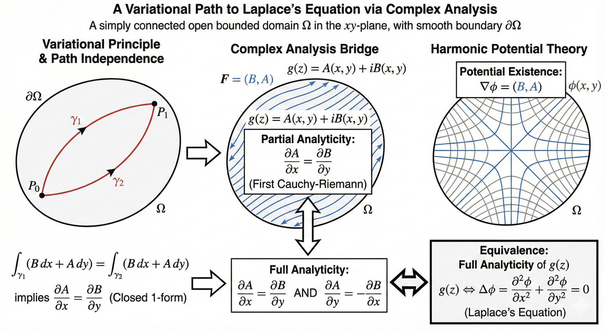

# A Variational Path to Laplace's Equation via Complex Analysis

Author: Haiyi Li

Date: 2026-10-07

## Main Thought

Analyticity of a complex function splits cleanly into two halves, and each half has a physical meaning:

- **path independence** of a line integral gives the *first* Cauchy–Riemann equation;
- **harmonicity** of the resulting potential is *exactly* the second one.

So an analytic function is the same thing as a vector field that is both curl-free and divergence-free.

## Setup

Let $\Omega\subset\mathbb{R}^2$ be a simply connected, open, bounded domain with smooth boundary $\partial\Omega$, and let $A,B\in C^2(\Omega)$. Consider

$$
F=(B,A),\qquad g(z)=A(x,y)+iB(x,y),\qquad \omega=B\,dx+A\,dy .
$$

## Step 1 — Path independence gives a closed 1-form

If for any two paths $\gamma_1,\gamma_2\subset\Omega$ from $P_0$ to $P_1$

$$
\int_{\gamma_1}(B\,dx+A\,dy)=\int_{\gamma_2}(B\,dx+A\,dy),
$$

then $\oint\omega=0$ around every closed loop, and by Green's theorem

$$
\frac{\partial A}{\partial x}=\frac{\partial B}{\partial y}.
$$

With $u=A$, $v=B$ this is the first Cauchy–Riemann equation $u_x=v_y$ for $g$ — only *partial* analyticity so far.

## Step 2 — A potential exists

Because $\Omega$ is simply connected, the closed form $\omega$ is exact:

$$
\phi(x,y)=\int_{P_0}^{(x,y)}\omega,\qquad \nabla\phi=(B,A),
$$

that is, $\phi_x=B$ and $\phi_y=A$.

## Step 3 — The second equation is Laplace's equation

The remaining Cauchy–Riemann equation $u_y=-v_x$ reads $A_y=-B_x$. Substituting the potential,

$$
A_y+B_x=\phi_{yy}+\phi_{xx}=\Delta\phi .
$$

Hence

$$
g \text{ analytic in } \Omega
\iff
\omega \text{ closed and } \Delta\phi=0 .
$$

In vector-field language: $\operatorname{curl}F=A_x-B_y$ and $\operatorname{div}F=B_x+A_y$, so $g$ is analytic exactly when $F$ is curl-free **and** divergence-free.

## A one-line check

Since $\phi_x=B$ and $\phi_y=A$,

$$
g=\phi_y+i\,\phi_x=i\,(\phi_x-i\,\phi_y)=2i\,\frac{\partial\phi}{\partial z},
$$

and $\partial\phi/\partial z$ is holomorphic precisely when $\phi$ is harmonic, because $\partial_{\bar z}\partial_z\phi=\tfrac14\Delta\phi$.

## Questions to Explore

- **Multiply connected domains.** On an annulus, $\omega$ can be closed without being exact (periods around the hole). What survives of the equivalence, and how do the periods relate to the logarithm?
- **Weaker regularity.** Can $C^2$ be relaxed to $C^1$ or to distributional derivatives (Weyl's lemma)?
- **Higher dimensions.** "Closed and co-closed" is the definition of a harmonic 1-form. How does this picture lead into Hodge theory?
